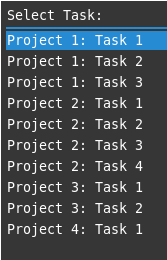
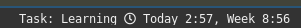
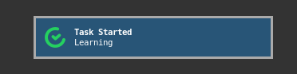

# Timecamp client for rofi and i3

A [Rofi](https://github.com/davatorium/rofi) based client for [Timecamp](https://www.timecamp.com/) built with NodeJS. Caches data locally however you must be online to log time. A future version may include offline support.  

When a task it started a new menu item will be available to stop it. If starting a second task, the first will be stopped before the second is started.  




Also includes support for i3blocks, left click to open the Rofi menu, right click to open the Timecamp website.  



A `notify-send` notification will also be sent when tasks are started/stopped, he's an example using `Dunst`.




## Installation

```
clone repo
cd into repo
mkdir ~/.config/timecamp
cp img/timecamp.png ~/.config/timecamp
npm i
sudo npm install -g .
```

Create the `.env` file at `~/.config/timecamp/.env` and populate with your Timecamp API key. Optionally set the timeout values.  

```
TIMECAMP_KEY=
TIMEOUT_TASKS=
TIMEOUT_ENTRIES=
```

Verify everything works by running `timecamp auto`, if you get no errors then it should be working fine.  

For the i3block, copy the `i3block` file into your `blocklets` directory, make it executable then call the file on a 60 second interval.  

Within your i3 config file add a keyboard shortcut for the menu and start the background task then reload your i3 config.

```
# Timecamp
bindsym $mod+t exec timecamp menu
exec --no-startip-id timecamp auto
```


## Usage

### timecamp tasks
Update the tasks list options presented by Rofi, the default is 1 hour.  

### timecamp entries
Update the logged time entries, the default is 1 minutes.  

### timecamp menu
Launch the Rofi menu.  

### timecamp i3block
Used by i3blocks.  

### timecamp auto
The background process to keep everything in sync.


## Future

This might happen if I need these features otherwise feel free to send a PR.  

- Offline support; add a basic queuing system to be run once you're back online
- Add notes to the time entry
- Add new tasks from the menu